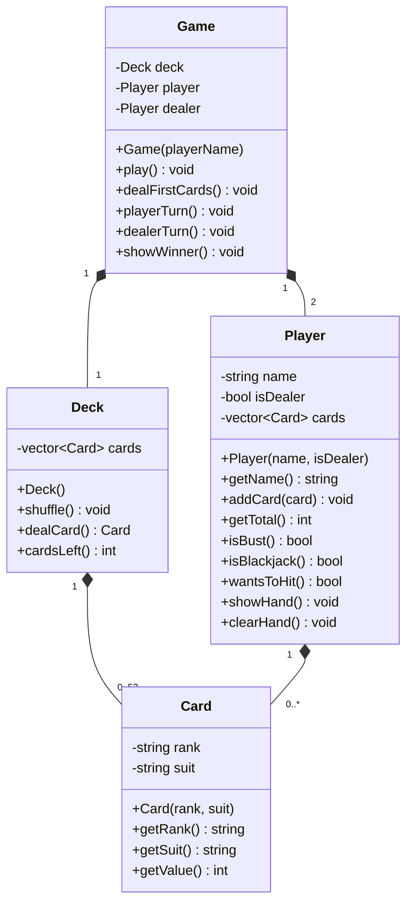

```mermaid
classDiagram
    class Card {
        -string rank
        -string suit
        +Card(rank, suit)
        +getRank() string
        +getSuit() string
        +getValue() int
    }

    class Deck {
        -vector~Card~ cards
        +Deck()
        +shuffle() void
        +dealCard() Card
        +cardsLeft() int
    }

    class Player {
        -string name
        -bool isDealer
        -vector~Card~ cards
        +Player(name, isDealer)
        +getName() string
        +addCard(card) void
        +getTotal() int
        +isBust() bool
        +isBlackjack() bool
        +wantsToHit() bool
        +showHand() void
        +clearHand() void
    }

    class Game {
        -Deck deck
        -Player player
        -Player dealer
        +Game(playerName)
        +play() void
        +dealFirstCards() void
        +playerTurn() void
        +dealerTurn() void
        +showWinner() void
    }

    Deck "1" *-- "0..52" Card
    Player "1" *-- "0..*" Card
    Game "1" *-- "1" Deck
    Game "1" *-- "2" Player
```
